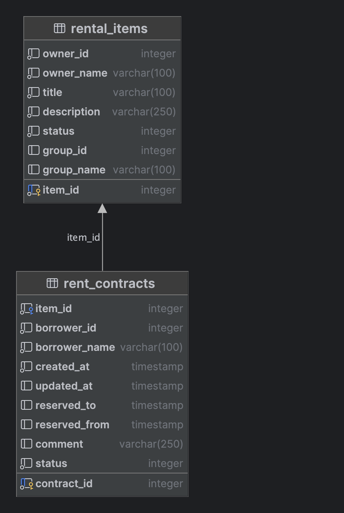
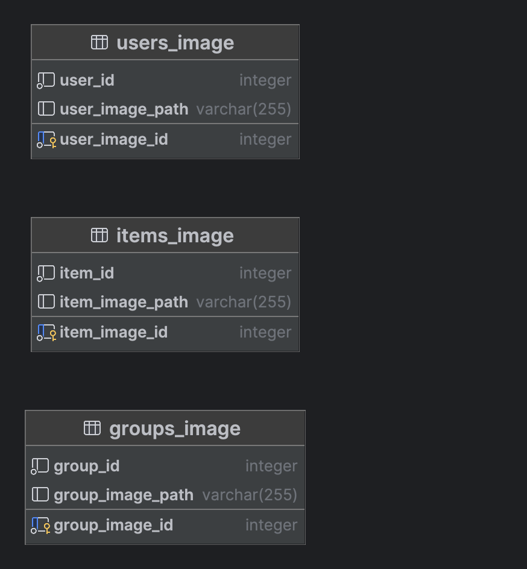
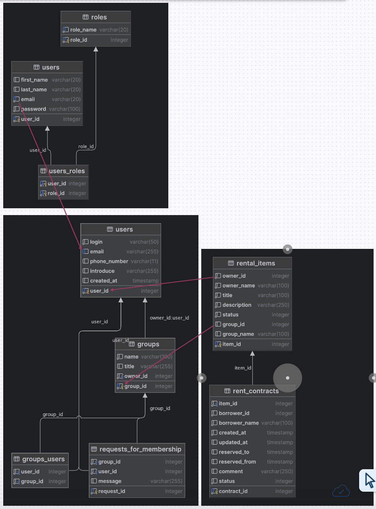

# ShareStorage
## Микросервисное приложение Spring Boot с PostgreSQL в контейнерах Docker

### Приложение в котором пользователи могут регистрироваться, объединяться в группы и публиковать свои вещи которые готовы безвозмездно отдать другим
Этот проект демонстрирует настройку приложения Spring Boot с использованием Spring Cloud, двумя микросервисами
с собственными базами данных PostgreSQL,
каждое из которых работает в отдельных контейнерах Docker.
Это достигается с использованием Docker Compose для оркестрации развертывания контейнеров.

## Структура проекта

Структура проекта выглядит следующим образом:

```plaintext
RESTApp/
│
├── Aggregator
│   └── src/
│       └── main/
│           ├── java/
│           └── resources/
│
├── EurekaServer
│   ├── src/
│   │   └── main/
│   │       ├── java/
│   │       └── resources/
│   └── Dockerfile.EurekaServer
│
├── APIGateway
│   ├── src/
│   │   └── main/
│   │       ├── java/
│   │       └── resources/
│   └── Dockerfile.APIGateway
│
├── WebClient
│   ├── src/
│   │   └── main/
│   │       ├── java/
│   │       └── resources/
│   └── Dockerfile.WebClient
│
├── UsersService/
│   ├── src/
│   │   └── main/
│   │       ├── java/
│   │       └── resources/
│   ├── Dockerfile.UsersService
│   │
│   └── UsersServicePostgreSQL/
│       ├── Dockerfile.UsersServicePostgreSQL
│       └── init.sql
│
├── ItemsService/
│   ├── src/
│   │   └── main/
│   │       ├── java/
│   │       └── resources/
│   ├── Dockerfile.ItemssService
│   │
│   └── ItemsServicePostgreSQL/
│       ├── Dockerfile.ItemsServicePostgreSQL
│       └── init.sql
│
├── ImageServer/
│   └── src/
│       └── main/
│           ├── java/
│           └── resources/
│
└── docker-compose.yml
```

- `Aggregator/`: Составной микросервис инкапсулирует в себе сбор всего запроса с клиента, сбор данных с отдельных миросервисов и предоставление необходимого ответа.
- `UsersService/`: Микросервис инкапсулирующий в себе логику работы с пользователями
- `UsersService/UsersServicePostgreSQL/`: Содержит файлы инициализации базы данных PostgreSQL для UsersService.
- `ItemsService/`: Микросервис инкапсулирующий в себе логику работы с товарами.
- `ItemsService/ItemsServicePostgreSQL/`: Содержит файлы инициализации базы данных PostgreSQL для ItemsService.
- `ImageServer/`: Микросервис отвечающий за хранение и работу с изображениями пользователей, вещей, групп.
- `docker-compose.yml`: Файл конфигурации Docker Compose для оркестрации развертывания обоих контейнеров.

## UsersService


## ItemsService



## ItemsService



## Schema DB




## Начало работы

### P.S. Problem(FIXED!!! Пропускайте этот шаг, запуск через Docker compose)
С добавление Spring security у меня возникли проблемы с организацией всего проекта в докере.
Работаю над запуском с помощью docker-compose.
Пока запустить получится только на локалке.
# :(

### P.S.S:
Для вавшего удобства я подготовил несколько скриптовв для запуска приложения:
1. Создание баз данных и их инициализация:
   ```bash
   sh build-scripts/init_databases.sh
   ```
   
2. Сборка модулей приложения:
   ```bash
   sh build-scripts/build-modules.sh
   ```
   
3. Запуск приложения:
   ```bash
   sh build-scripts/start_services.sh
   ```
   
4. Дождитесь развертывания приложения в контейнерах

5. Доступ к приложению: http://localhost:8081/
   <br>
   Users:<br>
   smak_simov@mail.ru:password <br>
   yshkin@yandex.ru:password <br>
   gazeta@gmail.com:qwerty0123 <br>

6. Остановка работы приложения:
   ```bash
   sh build-scripts/stop_services.sh 
   ```
   
7. Отображение запущенных java приложений:
   ```bash
   ps -ef | grep java 
   ```


## Следуйте этим шагам для запуска проекта:

1. Клонируйте репозиторий:

   ```bash
   git clone git@github.com:MaksimovSanan/SpringLessons.git
   cd SpringLessons/SpringREST/RESTApp
   ```

2. Соберите jar файлы каждого микросервиса
   ```bash
   sh build-scripts/build-modules.sh
   ```

3. Соберите и запустите Docker-контейнеры:

   ```bash
   docker-compose up -d
   ```

4. Дождитесь развертывания приложения в контейнерах

5. Доступ к приложению: http://localhost:8081
   <br>
   Users:<br>
   smak_simov@mail.ru:password <br>
   yshkin@yandex.ru:password <br>
   gazeta@gmail.com:qwerty0123 <br>

## Настройка

### Приложение Spring Boot

В файле `*/src/main/resources/application.properties` вы можете настроить параметры подключения к базе данных PostgreSQL:

```properties
spring.datasource.url=jdbc:postgresql://{postgres_container}:{5432}/{db_name}
spring.datasource.username=postgres
spring.datasource.password=postgres
spring.datasource.driver-class-name=org.postgresql.Driver
spring.jpa.database-platform=org.hibernate.dialect.PostgreSQLDialect
```

### База данных PostgreSQL

В файле `**/**PostgreSQL/Dockerfile.**` вы можете установить переменные среды для PostgreSQL, такие как имя базы данных, пользователя и пароль:

```Dockerfile
ENV POSTGRES_DB={db_name}
ENV POSTGRES_USER=myuser
ENV POSTGRES_PASSWORD=mypassword
```

## Дополнительные замечания

- Приложение Spring Boot доступно по адресу [http://localhost:8080](http://localhost:8080).
- База данных PostgreSQL для UsersService доступна по адресу [http://localhost:5432](http://localhost:5432).
- - База данных PostgreSQL для ItemsService доступна по адресу [http://localhost:5433](http://localhost:5433).